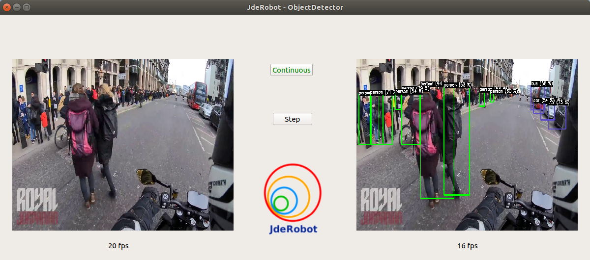

# ObjectDetector

### Contents

1. [Introduction](#introduction)
2. [Getting started](#getting-started)
3. [Installation](#installation)
4. [How to use](#how-to-use)
## Introduction

`ObjectDetector` is a JdeRobot node, composed of 3 entities: `Camera`, `GUI` and `DetectionNetwork`, which have been implemented on an asynchronous design on devoted threads. This program grabs an image from a given source (typically a webcam or video or a remote source, using ROS), preprocesses it, and passes it forward an SSD object detection network.

As a result, this program constantly shows the image captured, and the detected objects on the most recent output of the network, yielding the detection score as well. This continuous behavioral can be easily stopped via a couple of buttons on the GUI, making inferences on demand.




## Getting started
To get this component to work, you will need to install Python 3, several dependencies, and a few Python packages, installable via `python-pip`. See the [Installation](#installation) for more details.

Clone this repository, and you are ready to go!

`git clone https://github.com/JdeRobot/ObjectDetector.git && cd ObjectDetector`


## Installation
This component works on Ubuntu 18.04 and Python 3. In case you want to use inferences from a ROS topic, you will need the Melodic version of ROS, which can be installed [following the official steps](http://wiki.ros.org/melodic/Installation/Ubuntu).

Additionally, you will need some packages which can't be found on the Python repositories, thus they have to be manually installed issuing:
```bash
sudo apt install python3-pyqt5 python3-yaml
```

The remaining required packages have been listed for `pip` to install them automatically:

```bash
pip3 install -r requirements.txt
```
Execute this command using `sudo` if you are not using a virtual environment.


## How to Use

You need to use a TensorFlow neural network on which running the inferences. We provide in this repository a pre-trained model taken from [the TensorFlow Model Zoo](https://github.com/tensorflow/models/blob/master/research/object_detection/g3doc/detection_model_zoo.md). There you can find more models ready to work. You can choose a different one, but make sure that it outputs __boxes__ (masks are not supported yet), and specify its dataset and the path to the `.pb` file containing the graph in `objectdetector.yml`.


#### Detections from a video stream (ICE/ROS):
Under development.

#### Detections from a local camera/video file (OpenCV):

Just type into the YML configuration file which device/file you want to use, and set the YML node `Source: Local` for a webcam or `Source: Video` for a video file.

---
In another terminal type `python objectdetector.py objectdetector.yml`


This will start the component, driven by the configuration parsed from the YML file (video source and neural network parameters).

